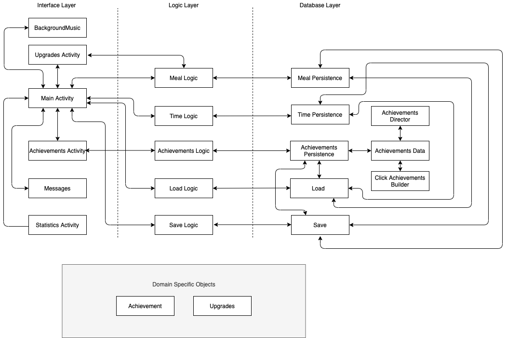

# Architecture  

### Iteration 1 Diagram  

### Iteration 2 Diagram  

  

### Iteration 3 Diagram  

  

### Presentation Layer  
- [Main Activity](https://code.cs.umanitoba.ca/3350-winter-2021-a01/group-8-overfeed-the-world/blob/master/app/src/main/java/comp3350/overfeed/presentation/MainActivity.java)  
  - The file for the screen launched at the start of the app as well as the view where majority of the game will take place  

- [Statistics Activity](https://code.cs.umanitoba.ca/3350-winter-2021-a01/group-8-overfeed-the-world/blob/master/app/src/main/java/comp3350/overfeed/presentation/StatisticsActivity.java)  
  - The file for the view of the statistics in the game  
  
- [Upgrades Activity](https://code.cs.umanitoba.ca/3350-winter-2021-a01/group-8-overfeed-the-world/blob/master/app/src/main/java/comp3350/overfeed/presentation/UpgradesActivity.java)  
  - The file for the view of the upgrades in the game 
  
- [Achievements Activity](https://code.cs.umanitoba.ca/3350-winter-2021-a01/group-8-overfeed-the-world/blob/master/app/src/main/java/comp3350/overfeed/presentation/AchievementsActivity.java)  
  - The file for the view of the achievements in the game  
  
- [Messages](https://code.cs.umanitoba.ca/3350-winter-2021-a01/group-8-overfeed-the-world/blob/master/app/src/main/java/comp3350/overfeed/presentation/Messages.java)  
  - The file for the view of the errors and warning messages that could be triggered in the game  

### Logic Layer  
- [Meal Logic](https://code.cs.umanitoba.ca/3350-winter-2021-a01/group-8-overfeed-the-world/blob/master/app/src/main/java/comp3350/overfeed/logic/MealLogic.java)  
  - The class that handles all Meal related logic. This includes methods needed for setting meals, getting clicks, etc.  

- [Time Logic](https://code.cs.umanitoba.ca/3350-winter-2021-a01/group-8-overfeed-the-world/blob/master/app/src/main/java/comp3350/overfeed/logic/TimeLogic.java)  
  - The class that deals with Time related logic such as methods for getting time and formatting time.  

- [Achievements Logic](https://code.cs.umanitoba.ca/3350-winter-2021-a01/group-8-overfeed-the-world/blob/master/app/src/main/java/comp3350/overfeed/logic/AchievementsLogic.java)  

  - The class that deals with Achievements related logic such as methods for checking which achievements the user already has, etc.    
- [Load Logic](https://code.cs.umanitoba.ca/3350-winter-2021-a01/group-8-overfeed-the-world/blob/master/app/src/main/java/comp3350/overfeed/logic/LoadLogic.java)  
  - The class that deals with Load related logic such as methods for loading the existing data from the database, etc.    
  
- [Save Logic](https://code.cs.umanitoba.ca/3350-winter-2021-a01/group-8-overfeed-the-world/blob/master/app/src/main/java/comp3350/overfeed/logic/SaveLogic.java)  
  - The class that deals with saving related logic such as methods for updating the save file to record the current progress in the game, etc.    
  
- [BackgroundMusic](https://code.cs.umanitoba.ca/3350-winter-2021-a01/group-8-overfeed-the-world/blob/master/app/src/main/java/comp3350/overfeed/logic/BackgroundMusic.java)  
  - The class that deals with the logic related to playing the background music in the game which features sounds from a restaurant.

### Persistence Layer  
- [Meal Persistence](https://code.cs.umanitoba.ca/3350-winter-2021-a01/group-8-overfeed-the-world/blob/master/app/src/main/java/comp3350/overfeed/persistence/MealPersistence.java)  
  - The class that deals with Meal related objects in the "database"  

- [Time Persistence](https://code.cs.umanitoba.ca/3350-winter-2021-a01/group-8-overfeed-the-world/blob/master/app/src/main/java/comp3350/overfeed/persistence/TimePersistence.java)  
  - The class that deals with Time related objects in the "database"  
  
- [Achievements Persistence](https://code.cs.umanitoba.ca/3350-winter-2021-a01/group-8-overfeed-the-world/blob/master/app/src/main/java/comp3350/overfeed/persistence/AchievementsPersistence.java)  
  - The class that deals with Achievements related objects 
  
- [Load Persistence](https://code.cs.umanitoba.ca/3350-winter-2021-a01/group-8-overfeed-the-world/blob/master/app/src/main/java/comp3350/overfeed/persistence/LoadHSQL.java)  
  - The class that deals with Load related objects 
  
- [Save Persistence](https://code.cs.umanitoba.ca/3350-winter-2021-a01/group-8-overfeed-the-world/blob/master/app/src/main/java/comp3350/overfeed/persistence/SaveHSQL.java)  
  - The class that deals with Save related objects 
  
- [Achievements Director](https://code.cs.umanitoba.ca/3350-winter-2021-a01/group-8-overfeed-the-world/blob/master/app/src/main/java/comp3350/overfeed/persistence/AchievementsDirector.java)  
  - The director class that controls how the Achievements related objects are created
  
- [Achievements Data](https://code.cs.umanitoba.ca/3350-winter-2021-a01/group-8-overfeed-the-world/blob/master/app/src/main/java/comp3350/overfeed/persistence/AchievementData.java)  
  - The class that deals with the complex Achievements related products
  
- [Click Achievements Builder](https://code.cs.umanitoba.ca/3350-winter-2021-a01/group-8-overfeed-the-world/blob/master/app/src/main/java/comp3350/overfeed/persistence/ClickAchievementBuilder.java)  
  - The concrete class that deals with the functions to help create Achievements related objects 

### Domain Specific Objects   
- For Iteration 1, we did not find any use for Domain Specific Objects with the functions that we have implemented. We will add them in our next iterations.  
 
- For Iteration 2 and 3, we have [Achievement](https://code.cs.umanitoba.ca/3350-winter-2021-a01/group-8-overfeed-the-world/-/blob/master/app/src/main/java/comp3350/overfeed/domainObjects/Achievement.java) and [Upgrades](https://code.cs.umanitoba.ca/3350-winter-2021-a01/group-8-overfeed-the-world/-/blob/master/app/src/main/java/comp3350/overfeed/domainObjects/Upgrades.java)
