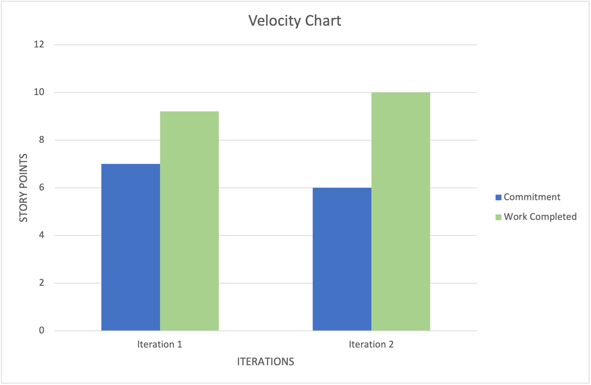

# Retrospective
Firstly, our discussion started with the positive aspects of iteration 2. The things we got done  that we wanted to get done were the Upgrades and Achievement features which were core components of the game and required a significant amount of coding. We were happy with the way the Achievement feature turned out in that we have a visible progress indicator on the achievement page as well as funny achievement names and descriptions. The Upgrade feature was also a great leap forward in turning our game from just “a button you click on” to an actual game with meaningful actions. The use of multithreading proved to be very helpful in having the meal count upgrade in the background while the user is free to click as they please. Additionally, the upgrade names were fun and everyone enjoyed the “Lamb Sauce” mega upgrade.

Secondly, we discussed as a group what didn’t get done and what went poorly for iteration 2. The main talking point here is the struggles we had with setting up persistent storage as it proved to be more complicated than anticipated. There were multiple components that we either didn’t know we needed or couldn’t get to work properly such as the gradle imports and the script file. Without persistent storage we were unable to complete the Save (and Load) feature since that is essentially what the Save feature entails. A significant part of the problem is that the group procrastinated a lot and we didn’t encourage each other enough to start sooner. Another side effect of procrastinating is that we racked up a fair amount of technical debt in trying to create pieces and components “as we need them” instead of planning better and also sticking to said plan. This resulted in more architectural changes as the software grows and evolves albeit somewhat sporadically, especially in places like the logic layer.

Lastly, we discussed the plan moving forward as a group. We are going to start much sooner and try to hold each other accountable for showing progress and work done every so often. We are also planning to have at least 1 meeting a week outside of class hours as well as meet on Fridays. A measurable and objective goal we have is that we are going to set a hard date before the due date to have all of our coding done (this includes features and tests) so that we can spend the last week or so working strictly on the website, the video, and any other paperwork or presentation that doesn’t involve coding. We would like to have things finalized on that date even if that includes dropping some features which we have a feeling will be the case based on what is left to do.

Project Velocity Chart for iteration 2:

