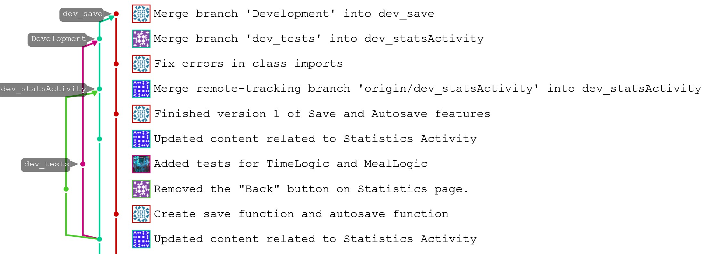

Iteration 1 Worksheet
=====================

Adding a feature
-----------------

Tell the story of how one of your features was added to the project.
Provide links to the
feature, user stories, and merge requests (if used), associated tests, and merge commit
that was used complete the feature.

Use one or two paragraphs which can have point-form within them.

We changed the implementation of our GUI according to depreciated content. Originally, our layout design
featured the bottom half of the screen being separated into tabs according to various features that 
were to be implemented in future iterations, as well as the statistics feature that we implemented during 
this iteration. However, the class we were planning on extending from in order to implement this split screen tab 
system had been depreciated. Accordingly, we changed our design to instead allow for a different page to display
the statistics.
Links:
Feature: https://code.cs.umanitoba.ca/3350-winter-2021-a01/group-8-overfeed-the-world/-/issues/5
User Story 1: https://code.cs.umanitoba.ca/3350-winter-2021-a01/group-8-overfeed-the-world/-/issues/8
User Story 2: https://code.cs.umanitoba.ca/3350-winter-2021-a01/group-8-overfeed-the-world/-/issues/9
New Statistics Activity page: https://code.cs.umanitoba.ca/3350-winter-2021-a01/group-8-overfeed-the-world/-/blob/5d9b4620b4c2f81f2a7bcef41215e797b3b0d9a7/app/src/main/java/comp3350/overfeed/presentation/StatisticsActivity.java

Exceptional code
----------------

Provide a link to a test of exceptional code. In a few sentences,
provide an explanation of why the exception is handled or thrown
in the code you are testing.

As our program does not contain any user input aside from the user clicking on a prexisting button,
there is not a portion of exceptional code that we were able to test in this iteration.
There are no instances of the user interacting with the system in exception prone ways, such as typing input, and so
we were unable to write a test to prepare for this exception.

Branching
----------

Provide a link to where you describe your branching strategy.

Provide screen shot of a feature being added using your branching strategy
successfully. The [GitLab Graph tool can do this](https://code.cs.umanitoba.ca/comp3350-summer2019/cook-eBook/-/network/develop),
as well as using `git log --graph`.

Link: https://code.cs.umanitoba.ca/3350-winter-2021-a01/group-8-overfeed-the-world/-/blob/36be03ad8dca50f31f9c3084ede231168d9c41cf/README.md
The description of our branching strategy can be found at the very bottom of README.md.

SOLID
-----

Find a SOLID violation in the project of group `(n%12)+1` (group 12 does group 1).
Open an issue in their project with the violation,
clearly explaining the SOLID violation - specifying the type, provide a link to that issue. Be sure
your links in the issues are to **specific commits** (not to `main`, or `develop` as those will be changed).

Provide a link to the issue you created here.

Group 9:

After rigerous inspection we as a group were unable to find a SOLID violation in Group 9' "9onLines" application. Everything appears to be structured correctly and solid.

Agile Planning
--------------

Write a paragraph about any plans that were changed. Did you
'push' any features to iteration 2? Did you change the description
of any Features or User Stories? Have links to any changed or pushed Features
or User Stories.

Link: https://code.cs.umanitoba.ca/3350-winter-2021-a01/group-8-overfeed-the-world/-/issues/3
We decided to completely remove the User Story #3 - Seeing meals increase per tap - in response to feedback
we received on Iteration 0. This user story was, in wording and concept, too close to another user story for
the same feature: User Story #4 Tapping on the plate and increasing the meal count. We decided to combine
the functionality of these two user stories.
Link: https://code.cs.umanitoba.ca/3350-winter-2021-a01/group-8-overfeed-the-world/-/issues/8
Similarly, we also changed the description of User Story #8 Seeing game progress. Originally, the user story 
stated that data would be picked from the temporary save file to be displayed in the statistics tab. This
was not true for the current elapsed time, which was run in the main activity file instead in order to be
able to display it on the screen. Currently we only displayed time in the statistics page, as it is the 
only real statistic we have access to at this point in time. We plan to continue expanding upon this page
throughout the other iterations as we add more features to the game.